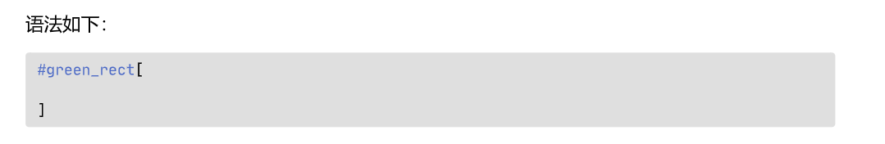

# Simple Typst note template


## 用法

你可以直接新建一个 Typst 文件，然后打出 `typst`，代码片段会补全

正文字体、字号在[模板](template.typ) 113 行处修改

代码字体在[模板](template.typ) 142 行处修改

页边距在[模板](template.typ) 98 行处修改

字间距、行间距在[模板](template.typ) 155 行处修改

段落缩进在[模板](template.typ) 144 行处修改

封面字体字号在[模板](template.typ) 39 行处修改

参考文献字体字号在[模板](template.typ) 160 行处修改

## 特点

- 代码块样式

效果：



- 绿色强调框

语法如下：

```typst
#green_rect[

]
```

效果：


- 参考文献

本笔记模板有参考文献，在最后一页，如果不想要笔记模板，你可以注释掉 `main.typ` 中的参数

## 鸣谢

这个项目用到了以下三个项目的代码

https://github.com/gRox167/typst-assignment-template

https://github.com/DVDTSB/dvdtyp

https://github.com/a-kkiri/SimpleNote
