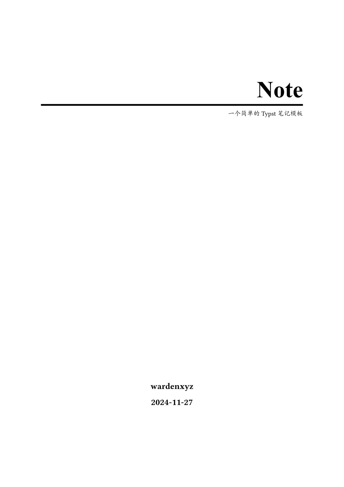
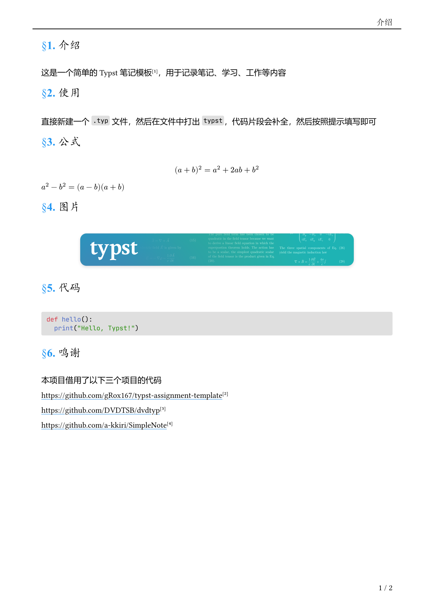
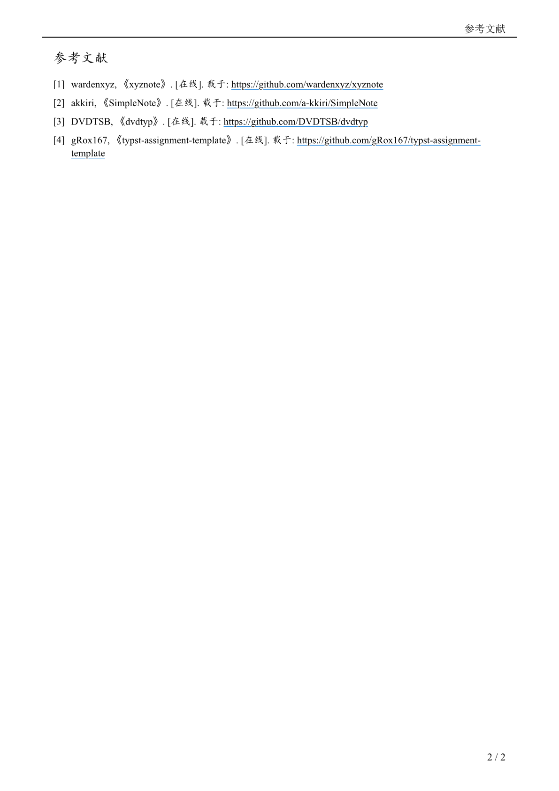

# Typst note template

简体中文 [English](README.md)

| 封面 | 目录 | 正文 | 参考文献 |
|:--:|:--:|:--:|:--:|
|  |  |  |  |

简单且实用的 Typst 笔记模板

xyznote 是一个专为 Typst 设计的模板，旨在帮助用户记录高效且有组织的笔记。它提供了一个干净且直接的结构，使得记录和整理想法变得更加简单。

## 使用

```typ
#import "@preview/xyznote:0.2.0": *

#show: xyznote.with(
  title: "xyznote",
  author: "wardenxyz",
  abstract: "A simple typst note template",
  createtime: "2024-11-27",
  lang: "zh",
  bibliographystyle: "ieee",
  bibliography-file: "refs.bib", //Annotate this line to delete the bibliography page.
)
```

## 功能特性

- **PDF 元数据**：包含标题、作者和日期字段。

- **目录**：自动生成的目录（ToC），便于在文档中导航。

- **引用（可选）**：一个专门用于引用来源和参考文献的部分。仅在需要时包含此部分。

## 自定义样式

```typ
#greenbox[
  Contents
]
```

```typ
#markblock[
  Contents
]
```

```typ
#sectionline
```

## 在 VSCode 中编辑（推荐）

1. 在 VS Code 中安装 [Tinymist Typst](https://marketplace.visualstudio.com/items?itemName=myriad-dreamin.tinymist) 扩展，它提供了语法高亮、错误检查和 PDF 预览功能。

2. 开始项目

```bash
typst init @preview/xyznote:0.2.0
```

```bash
cd xyznote
```

```bash
code .
```

3. 按 `Ctrl+K V` 打开 PDF 预览

4. 点击 Typst 文件顶部的 `Export PDF` 导出 PDF。

## 在 Webapp 中编辑

点击右侧的 `Create project in app` 按钮，在 Webapp 内编辑。

## 鸣谢

以下项目为本项目的开发提供了关键的灵感和重要的代码贡献。

https://github.com/gRox167/typst-assignment-template

https://github.com/DVDTSB/dvdtyp

https://github.com/a-kkiri/SimpleNote
