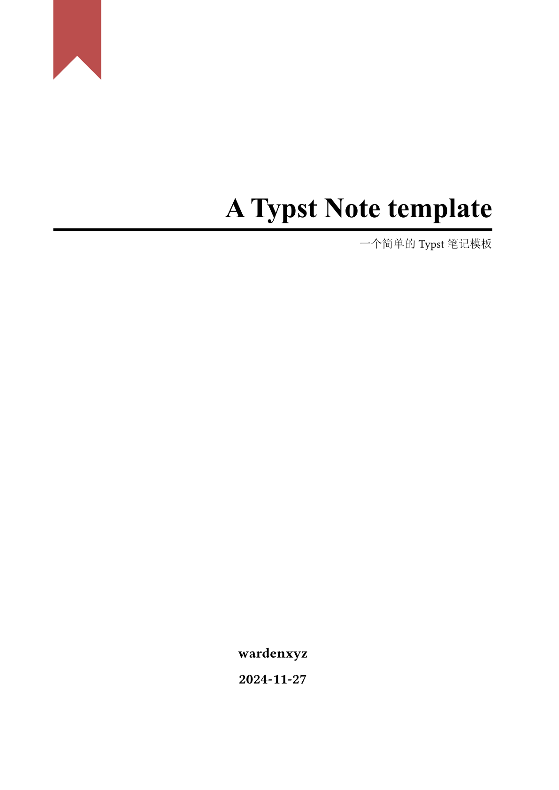
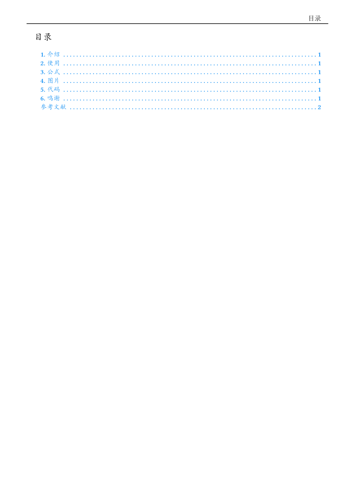
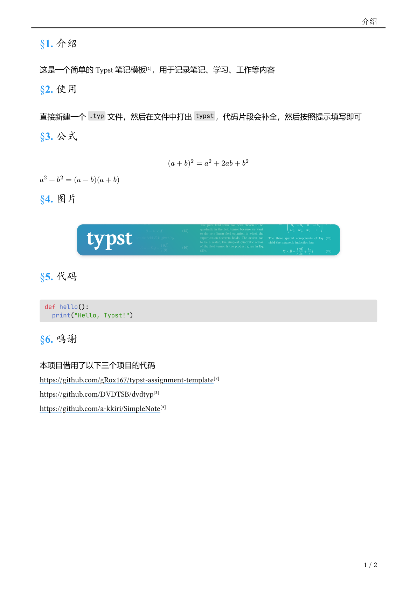
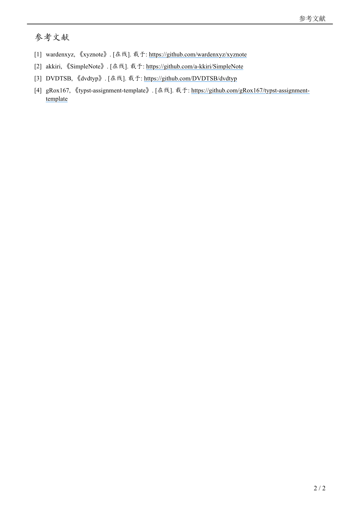

# Typst note template

简体中文 [English](README.md)

| 封面 | 目录 | 正文 | 参考文献 |
|:--:|:--:|:--:|:--:|
|  |  |  |  |

简单且实用的 Typst 笔记模板

xyznote 是一个专为 Typst 设计的模板，旨在帮助用户记录高效且有组织的笔记。它提供了一个干净且直接的结构，使得记录和整理想法变得更加简单。

## 使用

```typ
#import "@preview/xyznote:0.4.0": *

#show: xyznote.with(
  title: "xyznote",
  author: "wardenxyz",
  abstract: "A simple typst note template",
  createtime: "2024-11-27",
  lang: "zh",
  bibliography-style: "ieee",
  preface: [], //注释这一行删除序页
  bibliography-file: bibliography("refs.bib"), //注释这一行删除参考文献页面
)
```

## 功能特性

- **PDF 元数据**：包含标题、作者和日期字段。

- **目录**：自动生成的目录（ToC），便于在文档中导航。

- **引用（可选）**：一个专门用于引用来源和参考文献的部分。仅在需要时包含此部分。

## 提示框指令

xyznote 提供 19 种提示框指令，每种都有默认颜色、图标和中英文双语标题。

### 原始指令

```typ
#task[ 任务。 ]
#definition[ 定义。 ]
#brainstorming[ 头脑风暴。 ]
#question[ 问题。 ]
```

### 信息类

```typ
#note[ 补充信息。 ]
#hint[ 温和的提示。 ]
#tip[ 最佳实践或快捷方式。 ]
#seealso[ 相关参考。 ]
```

### 警告类

```typ
#attention[ 容易被忽略的内容。 ]
#caution[ 潜在的陷阱。 ]
#warning[ 可能造成问题。 ]
#important[ 不可遗漏的信息。 ]
```

### 危险类

```typ
#danger[ 可能造成数据丢失或损坏。 ]
#error[ 已知的错误条件。 ]
```

### 工具类

```typ
#todo[ 待办事项。 ]
#generic-admonition[ 通用自定义提示框。 ]
#generic-admonition(title: "自定义标题")[ 带有自定义标题。 ]
```

### 版本标记

```typ
#versionadded("2.0")[ 新增内容。 ]
#versionchanged("2.1")[ 变更内容。 ]
#deprecated("1.0")[ 弃用内容。 ]
```

## 自定义

每个指令都接受可选参数来完全控制外观：

```typ
#note(
  title: "自定义标题",
  title-size: 1.3em,
  body-size: 1.0em,
  primary-color: rgb("#7c3aed"),
  secondary-color: rgb("#ede9fe"),
  tertiary-color: rgb("#5b21b6"),
  text-color: rgb("#333"),
  emoji: emoji.rocket,
  dotted: true,
  lang: "zh",
)[ 内容。 ]
```

| 参数 | 说明 | 默认值 |
|---|---|---|
| `title` | 覆盖指令标题 | 根据类型和语言自动生成 |
| `title-size` | 标题字号 | `1.1em` |
| `body-size` | 正文字号 | `1.2em` |
| `primary-color` | 左边框颜色 | 随类型变化 |
| `secondary-color` | 背景填充颜色 | 随类型变化 |
| `tertiary-color` | 标题文字颜色 | 随类型变化 |
| `text-color` | 正文文字颜色 | `black` |
| `emoji` | 标题前的图标 | 随类型变化 |
| `dotted` | 使用虚线边框 | `false` |
| `lang` | `"en"` 或 `"zh"` | `"en"` |

### 全局字号默认值

一次性更改所有指令的标题和正文字号：

```typ
#set-admonition-defaults(title-size: 0.95em, body-size: 1.0em)
```

单独传入的 `title-size` / `body-size` 仍然优先。

## 其他自定义样式

```typ
#tipbox[ contents ]
```

```typ
#markbox[ contents ]
```

```typ
#sectionline
```

```typ
This is #highlight(fill: blue.C)[highlighted in blue].
This is #highlight(fill: yellow.C)[highlighted in yellow].
This is #highlight(fill: green.C)[highlighted in green].
This is #highlight(fill: red.C)[highlighted in red].
```

## 示例

查看 `examples/` 目录获取完整的工作文档：

- **`all-directives.typ`** — 每个指令及其使用代码
- **`customization.typ`** — 颜色、字号、图标、边框、全局默认值
- **`mixed-usage.typ`** — 技术文档中的实际使用场景
- **`color-themes.typ`** — 创意主题配色方案

## 在 VSCode 中编辑（推荐）

1. 在 VS Code 中安装 [Tinymist Typst](https://marketplace.visualstudio.com/items?itemName=myriad-dreamin.tinymist) 扩展，它提供了语法高亮、错误检查和 PDF 预览功能。

2. 开始项目

```bash
typst init @preview/xyznote:0.4.0
```

```bash
cd xyznote
```

```bash
code .
```

3. 按 `Ctrl+K V` 打开 PDF 预览

4. 点击 Typst 文件顶部的 `Export PDF` 导出 PDF。

## 在 Webapp 中编辑

点击右侧的 `Create project in app` 按钮，在 Webapp 内编辑。

## 鸣谢

以下项目为本项目的开发提供了关键的灵感和重要的代码贡献。

https://github.com/gRox167/typst-assignment-template

https://github.com/DVDTSB/dvdtyp

https://github.com/a-kkiri/SimpleNote

https://github.com/spidersouris/touying-unistra-pristine
